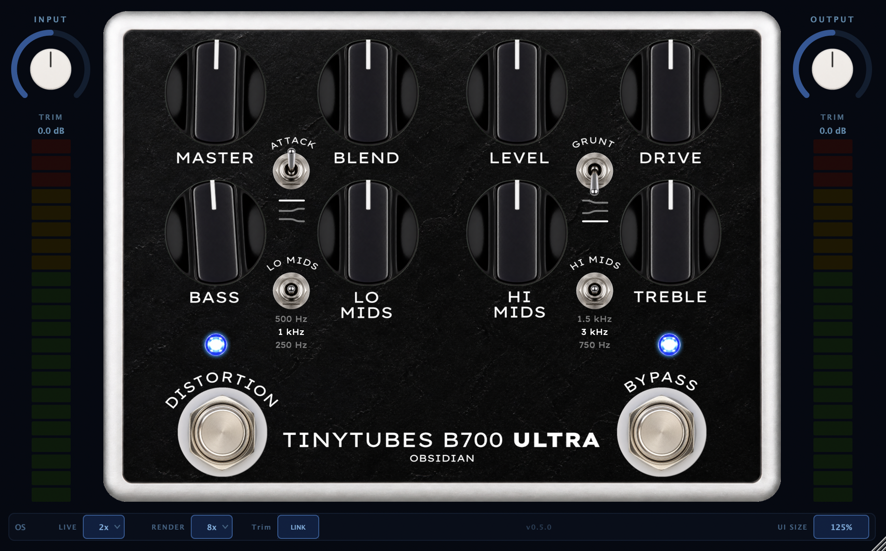

# Obsidian B7000

A circuit-accurate bass overdrive/DI preamp plugin (AU/VST3, JUCE 8) modelled directly from the
schematic of a **Darkglass B7K Ultra** — solved as a Wave Digital Filter from real component
values rather than approximated by ear. No neural captures, so turning the knob isn't moving between captures, it's reacting like the real pedal.



## What it is

Eight pots (**Master**, Blend, Level, Drive, Bass, Lo‑Mids, Hi‑Mids, Treble), two 3‑way toggles
(**Attack**: Boost/Flat/Cut, **Grunt**: three bass-content levels into the clipper), two 3‑position
frequency selectors (Lo‑Mid 250/500/1 kHz, Hi‑Mid 750 Hz/1.5 kHz/3 kHz), and two independent
footswitches — a true bypass and a second **Distortion** footswitch that mutes just the overdrive
path while the EQ/Master stage keep running, so the pedal can sit always-on as a clean DI/EQ with
drive stomped in on top.

- **CMOS-inverter overdrive**, not diode clipping — the distortion is a CD4049UBE unbuffered hex
  inverter driven into its own soft transition region, not a symmetric diode pair
- **An active J201 JFET gain stage** ahead of the clipper (common-source + active-load pair),
  contributing its own even-harmonic character before the signal ever reaches the CMOS stage
- **Full 4-band active EQ** (Baxandall Bass/Treble + two switchable-frequency mid peaking bands)
  built as coupled MNA networks, not independent biquads
- **Switchable oversampling** (1×/2×/4×/8×, separate Live/Render settings) with 1st-order ADAA on
  the JFET waveshaper
- **Faithful gain staging** — internal voltages are modelled in real volts against a measured input
  reference, not normalized ±1.0, so every nonlinearity clips where the real circuit actually would

## Under the hood

Every stage is built from the traced schematic (`.claude/rules/circuit.md`), cross-checked against
two independent schematic sources and the manufacturer's own published spec, and validated one
stage at a time before assembly:

- **Linear stages** (input buffer, treble/Attack network, Drive gain, recovery bridged-T, two
  Sallen-Key low-passes, Level/Blend crossfade, the full EQ block, Master output) are solved as
  MNA networks with trapezoidal-companion capacitors — precomputed per switch position, never
  rebuilt per sample — and each one's frequency response is checked against a closed-form oracle
  in `analysis/eq_reference.py` before moving on.
- **The J201 JFET stage** is modelled as a Wiener-Hammerstein cascade: an input high-pass, an
  HF-lift shelf from the source-degeneration bypass cap, an inverting mid-band gain, and a
  per-polarity soft waveshaper — output as a Norton current into the treble network's real input
  impedance (not an ideal voltage source), which is what makes the "HF lift" behave as the loaded
  circuit actually does rather than double-counting a shelf that isn't really there unloaded.
- **The CD4049UBE clipper** is a shunt-feedback stage around a fitted asymmetric-sigmoid inverter
  transfer curve, solved with the 4049's *finite* open-loop gain (not an ideal virtual ground —
  that measurably shifts the GRUNT switch's corner frequencies) via a warm-started Newton solve,
  with the input diodes modelled as hard rail clamps that are proven to never conduct in normal
  operation.
- **Rail saturation** on every op-amp output stage, gated off by default until the real pedal's
  supply rails are confirmed from captures.

Two of the twenty-plus circuit blocks — the CD4049UBE clipper and the J201 JFET stage — are the
only parts that aren't natively WDF elements; everything else (every R/C network, every ideal
op-amp stage, the rail-clamp diodes) is built directly from `chowdsp_wdf`. The sourcing behind both
nonlinear models — datasheets, a DAFx paper on this exact CMOS-overdrive topology, JFET SPICE
parameter sets — is in `docs/nonlinear-component-modeling.md`.

Three [ENG]-tagged features aren't on the schematic we traced (an original-B7K clone board) at all
— they're engineered to reproduce documented Ultra behaviour: the **Master** volume stage, the
**3-way Attack** switch (the stock 2-position network plus an added centre-flat), and the
**switchable mid frequencies** (computed cap values, nodal-sim-validated against the manufacturer's
own published frequency table to within 8.5%). See `circuit.md`'s `[ENG]` tags for exactly which
parts of the circuit are schematic-verified versus engineered-to-spec.

## Accuracy vs. the real pedal

*Placeholder — populated once Phase 9 (reference validation) runs.* Once calibration is accepted,
this section will report sub-sample-aligned null depth against the real B7K Ultra captures across
the drive/tone/switch matrix, the same way `analysis/null_test.py` and `VALIDATION_REPORT.md` do
for the sibling [Monarch of Tone](https://github.com/tehguitarist/MoT) project:

| Mode / setting | Best null vs. the real pedal |
|---|---|
| Clean (Drive min) | TBD |
| Mid-drive | TBD |
| Max drive | TBD |

## Performance

*Placeholder — populated once the `PerfBenchmark` probe is added (see `docs/build-plan.md`'s
performance-probe step, shared with the Monarch of Tone template). Expect the usual shape for a
WDF/Newton-solve plugin: oversampling is the CPU-vs-fidelity dial, with the JFET and CD4049
nonlinear solves the dominant per-sample cost.*

| Oversampling | CPU (≈ % of one core) | Added latency | Best for |
|---|---|---|---|
| **1×** | TBD | TBD | Tracking / low-latency live use |
| **2×** | TBD | TBD | Everyday playing |
| **4×** | TBD | TBD | Higher-fidelity highs |
| **8×** | TBD | TBD | Maximum fidelity |
| **Render** *(auto, offline bounce)* | — | TBD | Engages automatically on DAW export |

## Building

**Requirements:** CMake 3.15+, a C++17 compiler. AU + VST3 on macOS 10.13+; VST3 on Windows/Linux
(AU is an Apple-only format).

```bash
git clone https://github.com/tehguitarist/Obsidian-B7000.git
cd Obsidian-B7000

# Pull in dependencies (JUCE 8, chowdsp_wdf, xsimd)
git submodule update --init --recursive

# Configure and build
cmake -B build -DCMAKE_BUILD_TYPE=Release
cmake --build build --target ObsidianB7000_AU      # Audio Unit (macOS only)
cmake --build build --target ObsidianB7000_VST3    # VST3 (macOS/Windows/Linux)
```

`COPY_PLUGIN_AFTER_BUILD` is on, so a build installs straight to your system's plugin folder.
Logic caches AU components — bump the `VERSION` in `CMakeLists.txt` to force a rescan after
changes, or remove/re-add the plugin.

The build also produces the calibration/diagnostic tooling used during development:

| Target | What it does |
|--------|--------------|
| `OfflineRender` | Renders a WAV through the real `PedalChain`/`PedalDSP` at given knob-space settings, mirroring `processBlock` exactly, for A/B against a capture. `--fit name=value` overrides any calibration constant without a rebuild. |
| `EditorSnapshot` | Headless render of the plugin editor to PNGs at min/default/max UI scale — no display needed |
| `OSValidationTest` | Oversampling aliasing + delay-compensation gate (registered with CTest) |
| `InputBufferTest`, `TrebleAttackTest`, `DriveStageTest`, `RecoveryBridgedTTest`, `SallenKeyLPFTest`, `LevelBlendTest`, `MidBandTest`, `BaxandallTest`, `EqPreGainTest`, `MasterOutTest`, `JfetStageTest`, `ClipperTest`, `PedalChainTest` | Per-stage DSP correctness tests (see `tests/`), each checked against a closed-form oracle in `analysis/eq_reference.py` |

```bash
cmake --build build           # build everything, including the probes
ctest --test-dir build --output-on-failure
```

The Python side of the calibration harness needs NumPy/SciPy — on this project that means
`/opt/homebrew/bin/python3.11` specifically (a bare `python3` may resolve to a newer interpreter
without those packages installed):

```bash
python3.11 -m pip install -r analysis/requirements.txt   # if present, else numpy scipy
python3.11 analysis/captures.py                          # self-validates the capture filename matrix
```

## Where to find things

```
src/
  PluginProcessor.{h,cpp}   Top-level AudioProcessor, APVTS parameter layout, processBlock
  PluginEditor.{h,cpp}      Top-level editor
  dsp/                      One header per circuit stage (InputBuffer, TrebleAttack, DriveStage,
                             JfetStage, Clipper, RecoveryBridgedT, SallenKeyLPF, LevelBlend,
                             EqPreGain, Baxandall, MidBand, MasterOut, RailClamp) + PedalChain,
                             which wires the full signal path, and PedalDSP, the oversampling wrapper
  ui/                       PedalFace (data-driven from ui/component_positions.csv), the shared
                             LookAndFeel, VU meter, LED, three-position switch
  utils/TaperUtils.h        Pot taper math (audio/log vs. linear vs. fitted power-law)

tests/        Per-stage DSP validation programs (see table above)
analysis/     Real-pedal captures (gitignored — not in the repo), gen_test_signal.py (the A/B
              capture signal), analyze.py (FR / Farina swept-THD / sub-sample null harness),
              eq_reference.py (closed-form oracle for every linear stage), captures.py (capture
              filename grammar + OfflineRender CLI-argument mapping), fit_nonlinear.py (nonlinear
              parameter fitting), offline_render.cpp (source for the OfflineRender tool)
docs/
  nonlinear-component-modeling.md   datasheets/papers/recommended approach for the J201 + CD4049
  calibration-and-gain-staging.md  ★ input/output level calibration, taper fitting, rail modelling
  validation-and-capture.md        ★ how the plugin is measured against real-pedal captures
  ui-peripheral-spec.md            full visual spec for the reusable UI chrome
  phase7-calibration-handover.md   the working notes for the in-progress calibration fit
  build-plan.md                    the full step-by-step build plan with validation gates
.claude/rules/   Circuit topology (circuit.md — the source of truth for every component value and
                 node graph), DSP rules (dsp.md), plugin architecture (architecture.md), UI layout
                 (ui.md), and build setup (build.md)
```

## Thanks

Built on the shoulders of:

- [JUCE](https://juce.com) — the plugin framework
- [chowdsp_wdf](https://github.com/Chowdhury-DSP/chowdsp_wdf) — Wave Digital Filter library that
  made circuit-accurate modelling tractable
- [xsimd](https://github.com/xtensor-stack/xsimd) — SIMD acceleration

## License

This project is licensed under the [GNU Affero General Public License v3.0](LICENSE)
(AGPLv3), the same license under which the open-source edition of JUCE is distributed.
chowdsp_wdf and xsimd are compatible and included under their own license terms in `libs/`.

## Author

Leigh Pierce ([@tehguitarist](https://github.com/tehguitarist))
